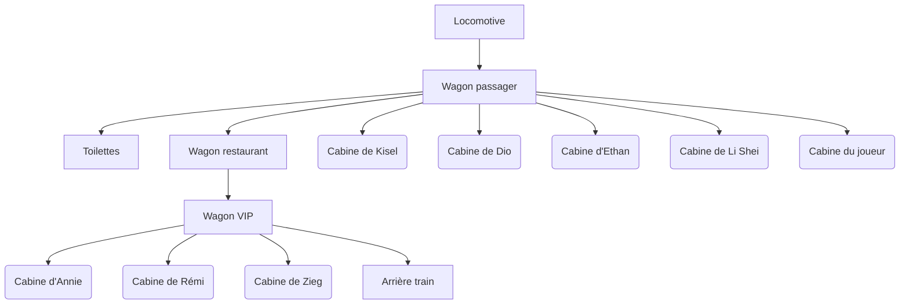

# The Golden Way

> Jeu d’enquête narratif se déroulant à bord d’un train en mouvement.

---

## Concept

**The Golden Way** est un jeu d’enquête dans lequel le joueur incarne un détective chargé de résoudre un meurtre survenu à bord d’un train.

Entre tensions sociales, personnages suspects et temps limité, le joueur devra :
- Interroger les passagers  
- Collecter des indices  
- Résoudre des énigmes  
- Identifier le coupable avant l’arrivée  

---

## Synopsis

**20 septembre XXXX**

Le *GoldenWay*, en route depuis deux heures, est le théâtre d’un drame :  
un passager est retrouvé mort.

Vous incarnez un détective chargé de résoudre l’affaire.

Mais entre :
- des témoins peu coopératifs  
- des conflits entre classes sociales  
- un temps limité (3 heures avant l’arrivée)  

chaque décision compte.

---

## Environnement

Le jeu se déroule entièrement dans un train, structuré en plusieurs zones :

- Locomotive  
- Wagon restaurant  
- Wagon VIP (3 cabines)  
- Wagon passager (5 cabines)  
- Toilettes  
- Couloirs inter-cabines  
- Arrière-train  

---

## Structure des niveaux

---

## Personnages

### Équipage
- **Rhale Baule** — Chauffeur blasé  
- **Rex Lamer** — Restaurateur  

### Serveurs
- **Esaa Pristi** — Serveuse maladroite  
- **Tauro Relout** — Serveur hautain  

### Passagers (classe moyenne)
- **Kisel Patron** — Déteste la police  
- **Dio Scese** — Croyant fervent  
- **Ethan Aule** — Complotiste  
- **Li Shei Tan** — Avocate, analytique  
- **Voy Yager** — Musicien clandestin (victime)  
- **Le protagoniste** — Détective  

### VIP
- **Rémi Plégie** — Scientifique amputé  
- **Annie Mation** — Artiste ouverte d’esprit  
- **Zieg Arrete** — Riche et méprisant  

---

## Déroulement du crime

- **Voy Yager**, musicien, monte clandestinement dans le train pour rencontrer **Annie Mation**  
- Affamé, il vole de la nourriture dans le wagon restaurant  
- **Rex Lamer** le tue avec un rouleau à pâtisserie  
- Le corps est caché dans les toilettes  
- Il est découvert plus tard par **Ethan Aule**

### Spoilers

- **Zieg Arrete** est le commanditaire :
  - Il tente de soudoyer **Esaa Pristi** (échec)  
  - Puis engage **Rex Lamer** pour commettre le meurtre  

---

## Gameplay

Le joueur progresse via :
- Dialogues avec les personnages  
- Déblocage de zones  
- Collecte d’objets  
- Résolution d’énigmes  

---

## Progression & interactions

Chaque personnage propose :
- Une interaction  
- Une condition  
- Une récompense  

### Exemples

- **Rhale Baule** → donne une clé  
- **Rex Lamer** → ralentit le joueur avec une quête  
- **Li Shei Tan / Rémi Plégie** → identifient le coupable avec des preuves  
- **Zieg Arrete** → permet d’accéder à des preuves  

---

## Exemple de puzzle

**Objectif : révéler des empreintes**

1. Récupérer de la farine dans la cuisine  
2. La combiner avec une cuillère  
3. Saupoudrer le rouleau à pâtisserie  
4. Révéler les empreintes digitales  

---

## Objectif du joueur

- Identifier le coupable  
- Comprendre le mobile  
- Rassembler les preuves  
- Résoudre l’affaire avant la fin du temps imparti  

---

## Notes

Le jeu met l’accent sur :
- la narration  
- la psychologie des personnages  
- les choix du joueur  
